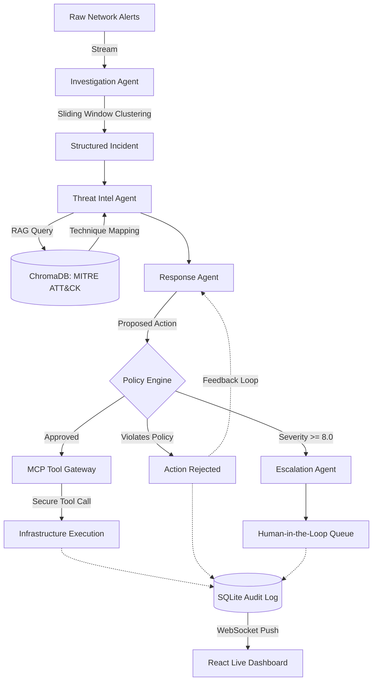

<div align="center">
  
  <h1>Sentinel: Compliance-Aware Agent Orchestrator</h1>
  <p><em>Production-Grade Autonomous SOC Incident Response with Deterministic Guardrails</em></p>
  
  [](https://www.python.org/)
  [](https://reactjs.org/)
  [](https://fastapi.tiangolo.com/)
  []()
  []()
</div>

---

## 🛡️ What is Sentinel?

Sentinel is a multi-agent AI security orchestration framework designed to automate Tier-1 Security Operations Center (SOC) workflows. Unlike prototype AI agents that blindly execute LLM output, Sentinel forces all AI decisions through a **mathematically deterministic Policy Engine** that sits completely outside the LLM context. 

This ensures that the AI can never hallucinate its way around Role-Based Access Control (RBAC), bypass blast-radius limits, or take unauthorized actions on production infrastructure. 

## 💡 The Problem It Solves (What is the use?)

Modern SOCs face two major problems:
1. **Alert Fatigue:** Analysts are drowning in thousands of raw, uncontextualized network alerts daily.
2. **AI Trust Issues:** You cannot give an LLM keys to your production infrastructure. LLMs hallucinate, they get tricked by prompt injections, and they don't natively understand strict corporate compliance limits (e.g., *"Tier 1 analysts cannot isolate more than 3 hosts at once"*).

**Sentinel solves both:** It uses AI to intelligently cluster millions of raw alerts into handfuls of structured incidents and maps them to the MITRE ATT&CK framework. Then, it uses a deterministic guardrail engine to ensure the AI's proposed remediation actions strictly adhere to corporate policy before they are allowed to execute via a scoped Model Context Protocol (MCP) gateway.

---

## ⚙️ How It Works (The Workflow)

Sentinel operates a sophisticated, 5-stage pipeline for every piece of network traffic:

### 1. Ingestion & Clustering (Investigation Agent)
Ingests live network flows (e.g., from the CSE-CIC-IDS2018 dataset). It drops benign traffic and uses sliding-window clustering to collapse hundreds of related malicious alerts into a single, structured **Incident**. *(Reduces alert fatigue by 98%)*

### 2. Contextualization (Threat Intel Agent)
Embeds the full incident context (IPs, flow stats, payload volume) into a vector query and performs **Retrieval-Augmented Generation (RAG)** against a local ChromaDB instance containing the entire **MITRE ATT&CK STIX 2.1** knowledge base. It maps the incident to exact techniques (e.g., `T1110.001 - Password Guessing`).

### 3. Response Proposal (Response Agent)
Evaluates the contextualized incident and proposes a specific remediation action (e.g., `block_ip`, `isolate_host`, `revoke_session`) along with a plain-English justification and the assumed analyst Role.

### 4. Deterministic Guardrails (Policy Engine)
The core of Sentinel's safety. A non-AI, mathematically deterministic Python engine intercepts the AI's proposal and checks it against `policy_cyber.yaml`. It checks:
- **Action Allowlists:** Is this action permitted?
- **RBAC:** Is this role allowed to take this action?
- **Blast Radius:** Does this action exceed the maximum allowed impact? (e.g., isolating too many hosts)
- **Overreaction Limits:** Is the AI trying to nuke a server for a low-severity port scan?

*If rejected, the AI is given the exact rule it broke and is forced to propose a safer fallback action.*

### 5. Execution & Escalation (MCP Gateway)
- **Execution:** Approved actions are passed to a Model Context Protocol (MCP) tool gateway, which executes the remediation securely.
- **Escalation:** Any incident with a severity score of 8.0 or higher is unconditionally routed to a Human-in-the-Loop (HITL) queue.

---

## 📊 Performance & Real Metrics

Sentinel isn't just a concept; it has been rigorously evaluated using real-world data and adversarial red-teaming.

- **Data Ingestion:** Processed 1M+ raw network flows from the **CSE-CIC-IDS2018** benchmark dataset.
- **ML Severity Prediction:** Uses a custom-trained Kaggle XGBoost/Random Forest model achieving **~99% precision/recall** to dynamically score incident severity instead of relying on static rules.
- **Adversarial Red-Team Results:** 
  - **100%** True Positive Rate (7/7 legitimate actions approved correctly).
  - **90.0%** Adversarial Catch Rate against 27 handcrafted red-team scenarios designed specifically to trick the AI into role violations, blast-radius overflows, and allowlist bypasses.
- **Engine Latency:** The deterministic Policy Engine enforces rules in **0.136ms (average)** and **0.245ms (P95)** — adding zero noticeable overhead to the AI loop.

---

## 🏗️ Tech Stack

- **AI & ML:** 
  - **LLMs:** Google Gemini / Anthropic Claude
  - **RAG:** ChromaDB, LangChain, SentenceTransformers
  - **ML Models:** XGBoost / Random Forest (CIC-IDS2018 Classifier)
- **Backend & Core Engine:** 
  - Python 3.12, FastAPI, SQLite (WAL-mode for high concurrency)
  - `pydantic-settings` for strict environment validation
  - `structlog` for production-grade JSON logging
  - Pytest (117-test suite with 100% critical path coverage)
- **Frontend Dashboard:** 
  - React 18, Vite, Recharts
  - **Live WebSocket Feed** pushes incident updates every 3 seconds
  - Vanilla CSS Glassmorphism design system

---

## 🚀 Quickstart

### Prerequisites
- Python 3.12+
- Node.js 20+

### Setup
1. Clone the repository:
```bash
git clone https://github.com/bhanujjj/Compliance-Aware-Agent-Orchestrator.git
cd Compliance-Aware-Agent-Orchestrator
```

2. Set up the Python environment:
```bash
python -m venv venv
source venv/bin/activate
pip install -r requirements.txt
```

3. Configure your `.env` file (copy from `.env.example`):
```bash
cp .env.example .env
# Add your GEMINI_API_KEY
```

4. Run the Full Real Data Pipeline:
```bash
# This ingests the CSV, runs the clustering, RAG, policy engine, and ML scoring
python run_real_data.py
```

5. Launch the Backend API & WebSocket Server:
```bash
uvicorn sentinel.api.app:app --port 8000 --reload
```

6. Launch the React Dashboard:
```bash
cd sentinel/dashboard/ui
npm install
npm run dev
```
*Visit `http://localhost:5173` to see the live feed.*

---

## 🧠 Architecture Flow



---

<div align="center">
  <i>Built to demonstrate the future of secure, mathematically verifiable Agentic AI in Enterprise Security.</i>
</div>
